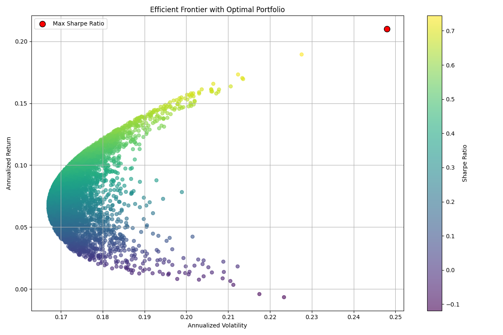

# 📈 Portfolio Optimization Tool

A Python-based tool that simulates Modern Portfolio Theory (MPT) for optimizing asset allocations based on risk and return. This project mirrors foundational functions found in BlackRock’s Aladdin platform, including risk modeling, Sharpe ratio maximization, and efficient frontier visualization.

---

## 🚀 Features

- ✅ Download historical stock data via `yfinance`
- 📊 Calculate expected annual return, volatility, and Sharpe ratio
- 🧠 Optimize portfolio weights using `scipy.optimize` to maximize Sharpe ratio
- 🌈 Plot the Efficient Frontier and visualize the optimal portfolio
- 📁 Exportable as PDF for presentations or interviews

---

## 🛠️ Tech Stack

- **Language**: Python 3
- **Libraries**: NumPy, Pandas, Matplotlib, SciPy, yfinance
- **Tooling**: Jupyter Notebook, Git, GitHub

---

## 🖥️ Preview

Efficient frontier chart (example):



> *(Add your own screenshot by saving a chart from the notebook as a .png and uploading it to the `notebooks/` folder)*

---

## 📄 Project Files

- [`Portfolio_Optimization.ipynb`](Portfolio_Optimization.ipynb) – Main notebook with full code and output
- [`Portfolio_Optimization.pdf`](Portfolio_Optimization.pdf) – Printable PDF version for presentation
- [`requirements.txt`](requirements.txt) – Install dependencies with `pip install -r requirements.txt`

---

## 🎯 Relevance to BlackRock Aladdin

Aladdin combines portfolio construction, performance tracking, and risk analytics. This project emulates core Aladdin functions:
- Portfolio modeling with real market data
- Optimization under constraints
- Visual risk-return mapping (efficient frontier)

---

## 📎 How to Run

1. Clone the repo:
```bash
git clone https://github.com/JBayliffCSUGLOBAL/portfolio-optimization.git
cd portfolio-optimization

